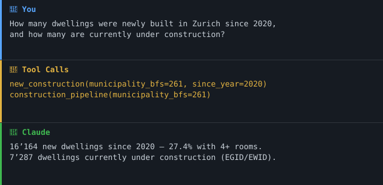

# swiss-housing-mcp

> Teil des [Swiss Public Data MCP Portfolio](https://github.com/malkreide/swiss-public-data-mcp) — Open-Source-MCP-Server, die KI-Agenten mit Schweizer öffentlichen Daten verbinden. **Privates Projekt, unabhängig von jeglichem Arbeitgeber oder institutioneller Zugehörigkeit.**

[](CHANGELOG.md)
[](LICENSE)
[](pyproject.toml)
[](https://modelcontextprotocol.io/)

> MCP-Server für das eidgenössische Gebäude- und Wohnungsregister (GWR/RegBL) — Gebäude, Wohnungen und die Bau-Pipeline

[🇬🇧 English Version](README.md)

---

## 🎯 Anchor Demo Query

> *«Wie viele Wohnungen sind seit 2020 in der Stadt Zürich neu erstellt worden, wie viele davon mit 4+ Zimmern — und wie viele sind aktuell im Bau?»*

Verifiziert gegen den Live-Dump am 24.07.2026: **16'164 neue Wohnungen** seit 2020 (27.4% mit 4+ Zimmern — der Familienwohnungs-Proxy) und **7'287 Wohnungen aktuell im Bau**. Wohnungen im Bau heute sind Haushalte in 1–3 Jahren: der Frühindikator für die Schulraumplanung.

### Demo



---

## Übersicht

Das GWR/RegBL ist für Gebäude, was Zefix für Firmen ist: nicht eine Datenquelle unter vielen, sondern das **eidgenössische Register**, dessen Identifikatoren (EGID für Gebäude, EWID für Wohnungen) als Referenzschlüssel quer durch die Schweizer Verwaltungsdaten dienen. Dieser Server erschliesst den öffentlichen Registerauszug über MCP-Tools — Gebäude-Lookups, Adress-Geocoding, Baustatistiken pro Gemeinde, Analysen unterhalb der Gemeindeebene (Bounding-Box) und die Planungs-/Bau-Pipeline.

`address_to_egid` ist der Stecker, der andere Datenquellen EGID-fähig macht: Adresse rein, eidgenössischer Identifikator und LV95-Koordinaten raus.

## Architektur-Entscheid

Dieser Server verwendet **Architektur B (Hybrid: Dump-first, API-Fallback)**.

Begründung (live verifiziert am 24.07.2026):

- Der öffentliche Kantonsdump (`public.madd.bfs.admin.ch/{kanton}.zip`) wird **täglich** aktualisiert (~05:30 MEZ) und enthält eine fertige `data.sqlite` mit den Tabellen `building` (399'830 Zeilen für ZH), `entrance`, `dwelling` (894'631 Zeilen für ZH) und `code`. Kein CSV-Parsing, keine Authentifizierung.
- `api3.geo.admin.ch` (find / identify / SearchServer) funktioniert zuverlässig ohne Authentifizierung für Einzel-Lookups und Geocoding, skaliert aber nicht für flächige Aggregationen (Result-Limits).
- Ein MADD-REST-Endpoint unter `/api/buildings/{egid}` lieferte 404; er bleibt ausgeschlossen, bis Pfad und Auth-Status geklärt sind — kein Blocker, da alle Phase-1-Tools ohne ihn auskommen.

Konsequenzen:

- Kantonsdumps werden auf Disk gecacht mit 24 h TTL (konfigurierbar via `SWISS_HOUSING_DUMP_TTL_HOURS`).
- Aggregationen und räumliche Abfragen laufen als Read-only-SQL gegen die gecachte SQLite; Einzel-Lookups und Geocoding gehen an die Live-API.
- Jede Response trägt `source` (Attribution) und `provenance` (`daily_dump` | `live_api` | `cached`).

### Live-Probe-Befunde (24.07.2026)

| Endpoint | HTTP | Status | Bemerkung |
|---|---|---|---|
| `api3.geo.admin.ch …/find` (EGID-Lookup) | 200 | ✅ funktioniert | voller Attributsatz, No-Auth |
| `api3.geo.admin.ch …/identify` (Koordinaten) | 200 | ✅ funktioniert | 77 Attribute inkl. EGID/EWID |
| `…/SearchServer` (Adresse → EGID) | 200 | ✅ funktioniert | `featureId` = `{EGID}_{EDID}`; Achsentausch: `y`=Ost, `x`=Nord |
| `public.madd.bfs.admin.ch/zh.zip` | 200 | ✅ funktioniert | 121 MB, täglicher Refresh, enthält `data.sqlite` |
| `madd.bfs.admin.ch/api/buildings/{egid}` | 404 | ❌ ausgeschlossen | Pfad/Auth ungeklärt |
| Invalider EGID auf find | 200 | ⚠️ Soft-Error | leeres `results`-Array — kein HTTP-Fehler |

## Funktionen

- **`lookup_building(egid)`** — einzelnes Gebäude per eidgenössischem Identifikator (Live-API)
- **`address_to_egid(address)`** — beliebige Schweizer Adresse zu EGID/EDID + LV95 geocodieren
- **`lookup_dwellings(egid)`** — alle Wohnungen eines Gebäudes mit Zimmern, Fläche, Stockwerk
- **`new_construction(municipality_bfs, since_year)`** — jährliche Neubautätigkeit inkl. 4+-Zimmer-Anteil (Familienwohnungs-Proxy)
- **`construction_pipeline(municipality_bfs)`** — projektiert / bewilligt / im Bau
- **`buildings_in_bbox(e_min, n_min, e_max, n_max)`** — Analyse unterhalb der Gemeindeebene (z. B. Schulkreise)
- **`municipality_housing_stats(municipality_bfs)`** — Wohnungsbestand und Zimmergrössen-Mix
- **`explain_code(attribute, code)`** — GWR-Codes via offizielle DE/FR/IT-Codetabelle entschlüsseln
- **`dump_status()`** — Cache-Frische, Graceful-Degradation-Einstiegspunkt

## Voraussetzungen

- Python 3.10+
- ~130 MB Disk pro gecachtem Kantonsdump (ZH)
- Keine API-Keys — Phase 1 ist authentifizierungsfrei

## Installation

```bash
uvx swiss-housing-mcp        # sobald auf PyPI publiziert

# oder aus dem Quellcode
pip install -e .
```

## Verwendung / Quickstart

**Claude Desktop** (`claude_desktop_config.json`):

```json
{
  "mcpServers": {
    "swiss-housing": {
      "command": "uvx",
      "args": ["swiss-housing-mcp"]
    }
  }
}
```

**Cloud (Render/Railway):**

```bash
SWISS_HOUSING_TRANSPORT=streamable-http PORT=8000 swiss-housing-mcp
```

## Konfiguration

| Variable | Default | Zweck |
|---|---|---|
| `SWISS_HOUSING_TRANSPORT` | `stdio` | `stdio` \| `streamable-http` \| `sse` |
| `SWISS_HOUSING_CACHE` | `~/.cache/swiss-housing-mcp` | Dump-Cache-Verzeichnis |
| `SWISS_HOUSING_DUMP_TTL_HOURS` | `24` | Dump-Frische-Fenster |

## Testing

```bash
PYTHONPATH=src pytest tests/ -m "not live"   # CI-tauglich
PYTHONPATH=src pytest tests/ -m live         # gegen echte Quellen
```

## Projektstruktur

```
swiss-housing-mcp/
├── src/swiss_housing_mcp/
│   ├── server.py      # FastMCP-Tools (9)
│   ├── gwr.py         # Dump-Store + geo.admin.ch-Client + Retry
│   ├── models.py      # Pydantic-v2-Envelopes (source + provenance)
│   └── __main__.py    # Dual-Transport-Entry-Point
├── tests/             # respx-gemockt + @pytest.mark.live
└── .github/workflows/ # CI + OIDC-PyPI-Publish
```

## Known Limitations

- Der öffentliche Auszug enthält keine personenbezogenen und einzelne sensible Attribute des vollen GWR; amtliche Datenlieferungen an Behörden laufen über den BFS/MADD-Kanal.
- Koordinaten sind Gebäude-Referenzpunkte (LV95), keine Grundriss-Polygone — Polygon-Joins (z. B. exakte Schulkreisgrenzen) benötigen externe Geometrien; `buildings_in_bbox` deckt die rechteckige Näherung ab.
- `GBAUJ` (Baujahr) fehlt bei einem Teil älterer Gebäude; Perioden-Codes (`GBAUP`) existieren als Fallback, sind aber noch nicht exponiert.
- Die Auflösung Gemeinde→Kanton ist für häufige Fälle vorbelegt; für andere den `canton`-Parameter explizit übergeben.
- Wohnungsmarkt-Indizes (IMPI, Baupreisindex, Leerwohnungsziffer) liegen bewusst in `swiss-statistics-mcp` — dieser Server ist die Register-Schicht, nicht die Statistik-Schicht.

## Changelog

Siehe [CHANGELOG.md](CHANGELOG.md)

## Mitwirken

Beiträge sind willkommen — siehe [CONTRIBUTING.de.md](CONTRIBUTING.de.md) ([English](CONTRIBUTING.md)).

## Sicherheit

Rein lesend, keine Personendaten, keine Authentifizierung — ein öffentliches
Bundesregister über einen festen Satz von Endpoints. Siehe
[SECURITY.de.md](SECURITY.de.md) ([English](SECURITY.md)) für die vollständige
Sicherheitslage und die Meldung von Schwachstellen.

## Lizenz

MIT License — siehe [LICENSE](LICENSE). Daten: GWR/RegBL, Bundesamt für Statistik (BFS), Open Government Data mit Quellenangabe.

## Credits & Verwandte Projekte

- Daten: [Bundesamt für Statistik — GWR/RegBL](https://www.housing-stat.ch/), [geo.admin.ch](https://api3.geo.admin.ch/)
- Portfolio-Geschwister: [`swiss-statistics-mcp`](https://github.com/malkreide/swiss-statistics-mcp) (Indizes, STAT-TAB), [`zurich-opendata-mcp`](https://github.com/malkreide/zurich-opendata-mcp) (städtische Daten)

## Autor

malkreide · [GitHub](https://github.com/malkreide)
